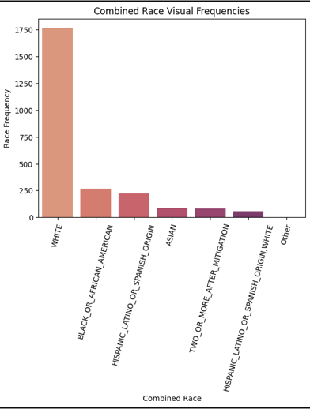
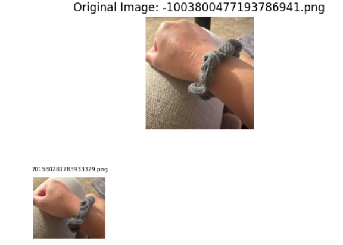
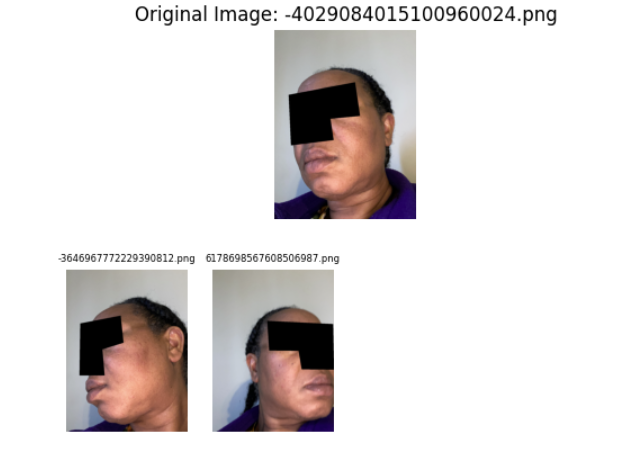
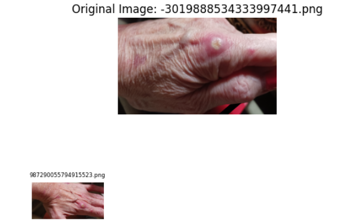
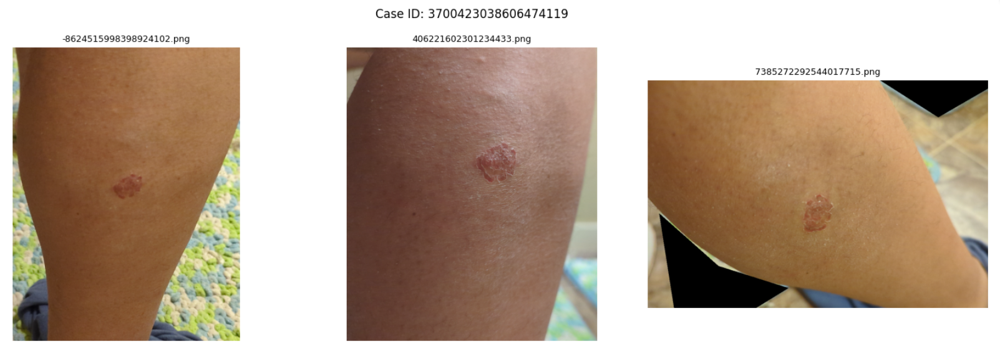
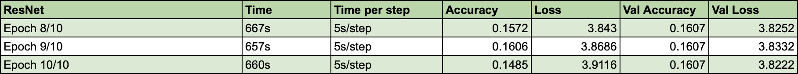

# Multi-Modal Skin Condition Classification - Skinterest Tech 2A

---

## 👥 **Team Members**

| Name             | GitHub Handle | Contribution                                                             |
|------------------|---------------|--------------------------------------------------------------------------|
| Nivi Munjal    | @nbm016 | Data Cleaning and Exploration, Image Similarity Analysis, Data Visualization, Model Research, Building, Training, and Evaluation            |
| Sarah Shafiq   | @sshafiq1     | Data preprocessing, Model selection, model training and optimization       |
| Mahek Patel     | @mahekp05  | Data preprocessing, Image Analysis, Image Cleaning, Model training, Database Configurations, Metrics Research | 
| Adhuresa Ukaj      | @adhuresau      | Data preprocessing, image analysis, and feature preparation for modeling |

---

## 🎯 **Project Highlights**

- Developed a machine learning model utilizing computer vision and supervised learning to address skin classification problems for different population subgroups through diverse user-submitted photos.
- Leveraged the Google Skin Condition Image Network (SCIN) dataset, which emphasizes fairness, diversity, and representation across skin tones.
- Explored CNN and transfer learning models (ResNet-50) and analyzed challenges such as class imbalance, missing labels, and overfitting.
- Generated insights on data quality, fairness metrics, and modeling limitations to inform future inclusive AI development at Skinterest Tech.

---

## 👩🏽‍💻 **Setup and Installation**

* View the notebook files in this repository for data exploration, data cleaning, image analysis, and model building/training of this dataset.
* Place the notebook files in Google Colab to run the code. Google Colab will ask for authorization when running the code.
* The SCIN dataset for this project is accessed from the code.
* To save the trained models, adjust the filepaths in the code to desired filepaths/locations. 

---

## 🏗️ **Project Overview**

This project was developed as part of the **Break Through Tech AI Program (AI Studio)** in collaboration with **Skinterest Tech**. The goal of the project was to explore the use of machine learning and computer vision techniques to improve skin condition classification across diverse populations, with a particular focus on fairness and representation.

Skinterest Tech aims to transform the dermatology and skincare space by providing more inclusive and comprehensive skin analysis tools. Many existing dermatology datasets and models underrepresent individuals with darker skin tones, which can lead to biased or unreliable predictions. This project addresses that gap by leveraging the **Google Skin Condition Image Network (SCIN)** dataset, which was explicitly designed to emphasize diversity, fairness metrics, and real-world user-submitted images.

The objective of this work was to design, train, and evaluate image-based and multimodal models capable of classifying skin conditions from user-submitted photos, while identifying the technical and data-related challenges that arise when working with large, diverse medical image datasets. The scope of the project included data exploration, image quality analysis, preprocessing, model selection, training, evaluation, and reflection on limitations related to class imbalance, missing labels, and fairness considerations.

This work has real-world significance in helping improve diagnostic support tools for underrepresented populations and advancing fairness-aware machine learning practices in healthcare-related applications.

 

---

## 💻 **Code Highlights**
**Code Files**
* Coding for this project utilized Google Colab notebooks, which can be found in the main repository.
* Files in the format of "Skinterest_Tech_2A_Coding_1.ipynb" contain data exploration, cleaning, preprocessing, and image analysis for a smaller subset of the SCIN dataset.
* Files in the format of "SCIN_Dataset_Colab2.ipynb" contain data exploration, cleaning, preprocessing, and image analysis for the full SCIN dataset.
* Files in the format of "Model_Building.ipynb" contain model building, training, and evaluation.

**Coding Libraries**
* Python Pandas, TensorFlow, Scikit-Learn, SciPy, Matplotlib, OpenCV, ImageDedup, CleanVision - ImageLab
---

## 📊 **Data Exploration**

**Dataset: Skin Condition Image Network (SCIN) Google Dataset**
* Crowdsourced from Google Search users to increase the diversity of dermatology images available for public health education and research.
* Images in dataset are paired with self-reported metadata dermatologist expert skin condition labels.
* Emphasis of diversity and fairness in this dataset compared to other skin condition datasets.
* Format: Google Cloud Storage (GCS) - User Metadata and Images
* Relevant Features: Dermatologist condition labels and confidence scores, race and ethnicity, monk skin tone scale, image paths
* Size: 5,000+ user contributions and 10,000+ total images (up to 3 images per user/case)
* Types of Data: Images, Text, Categorical
 
  
**Exploration and Preprocessing Approaches**
* Removed images from dataset with low quality, such as low brightness.
* Identified similar images to capture a variety of angles for certain skin condition images. 
* Conducted a diversity analysis of submitted photos using race/ethnicity and monk skin tone scale.
* Highlighted the representation of common skin conditions in dataset (eczema).
* Analyzed metadata about users and their submitted skin condition photos (age, location of skin condition, relevant symptoms, texture of conditions, and more).
 

**Challenges in Dataset**
* Fair representation of diversity in dermatology.
* Many images did not have an associated skin condition label and confidence score.
* Other missing data for certain metadata columns (race/ethnicity, age).
 

**Data and Image Visualizations**   
Race Distribution of Dataset's Users:
  

  

Examples of User-Submitted Skin Conditions (Multiple Angles Included):
  

 

---

## 🧠 **Model Development**

### Models Used
We explored both baseline and transfer learning–based computer vision models for skin condition classification.

- **Baseline CNN**  
  Implemented a lightweight convolutional neural network with two convolutional layers (32 and 64 filters) to validate the data pipeline and establish baseline performance.

- **Transfer Learning (ResNet-50)**  
  Used a pretrained ResNet-50 architecture as the primary image backbone. Residual connections help stabilize training for deeper networks and improve feature extraction on complex dermatology images.

- **Multimodal Extension (Image + Metadata)**  
  Experimented with a multimodal architecture that fused image embeddings with structured metadata via a parallel feature branch. This approach aimed to incorporate clinical context alongside visual patterns, though missing data and alignment issues limited early performance.

### Feature Selection and Engineering
We evaluated multiple feature groups from the SCIN dataset:

- Image features: RGB images resized to 224×224 and normalized
- Clinical metadata: body location, condition symptoms, texture indicators
- Fairness-related attributes: Monk Skin Tone (MST), Fitzpatrick skin type
- Demographic attributes: race/ethnicity (used cautiously due to missing values)

For supervised learning, samples without dermatologist-labeled skin condition labels were removed to avoid noisy supervision. Image quality filtering was applied to remove extremely low-brightness images unless diagnostic texture or redness was still visible.

### Hyperparameter Tuning Strategy
Due to dataset size and cloud-based training constraints, hyperparameter tuning was conducted iteratively rather than through exhaustive grid search. Experiments focused on:

- Learning rate adjustments using the Adam optimizer
- Batch size tuning to improve training stability
- Exploration of regularization techniques (dropout and L2, planned for future work)
- Freezing versus partial unfreezing of pretrained layers

Tuning decisions were guided by observed behaviors such as overfitting, stagnant validation accuracy, and loss instability.

### Training Setup and Evaluation
- Data split: stratified train/validation split where class counts allowed
- Training environment: TensorFlow in Google Colab with images streamed directly from Google Cloud Storage (GCS)
- Loss function: sparse categorical cross-entropy
- Optimizer: Adam
- Primary evaluation metric: accuracy
- Additional metrics considered: precision, recall, F1-score, balanced accuracy

### Baseline Performance and Observations
- **CNN baseline:**  
  Achieved very high training accuracy (approximately 99%) but poor validation accuracy (approximately 20%), indicating strong overfitting and memorization.

- **ResNet-50 baseline:**  
  Training and validation accuracy remained near random chance, highlighting challenges related to class imbalance, limited labeled data per class, and the need for further tuning.

These findings motivated future work on data balancing, multimodal feature integration, and richer evaluation metrics beyond raw accuracy.

---

## 📈 **Results & Key Findings**

* All models performed with around 99% training accuracy but that would drop to around 20% validation accuracy.
* Models performed better on identifying larger class labels like eczema or allergic contact dermatitis.
* The CNN baseline memorized training data, while the ResNet-50 model remained near random performance due to class imbalance and limited labeled data.
* These results highlight the difficulty of dermatology classification with real-world, imbalanced datasets and the need for richer evaluation metrics beyond accuracy.

* ResNet evaluation metrics:

---

## ⚠️ Limitations

* Some skin conditions had many more images than others, making it hard for the models to learn rare conditions.
* Many images were missing dermatologist labels or confidence scores, which reduced the amount of usable training data.
* Combining image data with metadata was challenging due to missing values and alignment issues.
* Limited computing resources restricted extensive model tuning and experimentation.

---

## 🚀 **Next Steps**

* Experiment with additional feature combinations for model building and training
* Apply both supervised and unsupervised machine learning methods to learn hidden trends and patterns, especially with unlabeled data.
* Web application of skin condition classification: Users can submit their own skin condition images and have them evaluated in real-time by models. 

---

## 📝 **License**

Copyright 2025 Skinterest Tech

Licensed under the Apache License, Version 2.0 (the "License");
you may not use this file except in compliance with the License.
You may obtain a copy of the License at

http://www.apache.org/licenses/LICENSE-2.0

Unless required by applicable law or agreed to in writing, software
distributed under the License is distributed on an "AS IS" BASIS,
WITHOUT WARRANTIES OR CONDITIONS OF ANY KIND, either express or implied.
See the License for the specific language governing permissions and
limitations under the License.

---

## 📄 **References**

* Hartanto, D., & Herawati, R. (2024). COMPARATIVE ANALYSIS OF EFFICIENTNET AND RESNET MODELS IN THE CLASSIFICATION OF SKIN CANCER. Proxies : Jurnal Informatika, 7(2), 69–84. https://doi.org/10.24167/proxies.v7i2.12468
* Narla, S., Heath, C. R., Alexis, A., & Silverberg, J. I. (2022). Racial disparities in dermatology. Archives of Dermatological Research, 315(5). https://doi.org/10.1007/s00403-022-02507-z (https://pmc.ncbi.nlm.nih.gov/articles/PMC9743121/)
* Randellini, E. (2023, January 5). Image classification: ResNet vs EfficientNet vs EfficientNet_v2 vs Compact Convolutional…. Medium. https://medium.com/@enrico.randellini/image-classification-resnet-vs-efficientnet-vs-efficientnet-v2-vs-compact-convolutional-c205838bbf49 
---

## 🙏 **Acknowledgements** 

Thank you to our BTT Coach Nandini Proothi, and our Challenge Advisors from Skinterest Tech, Ashley Abid and Thandi Robins.
